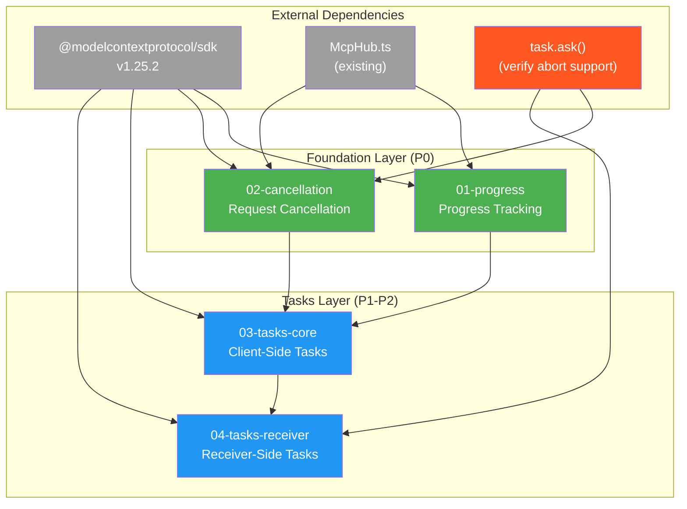
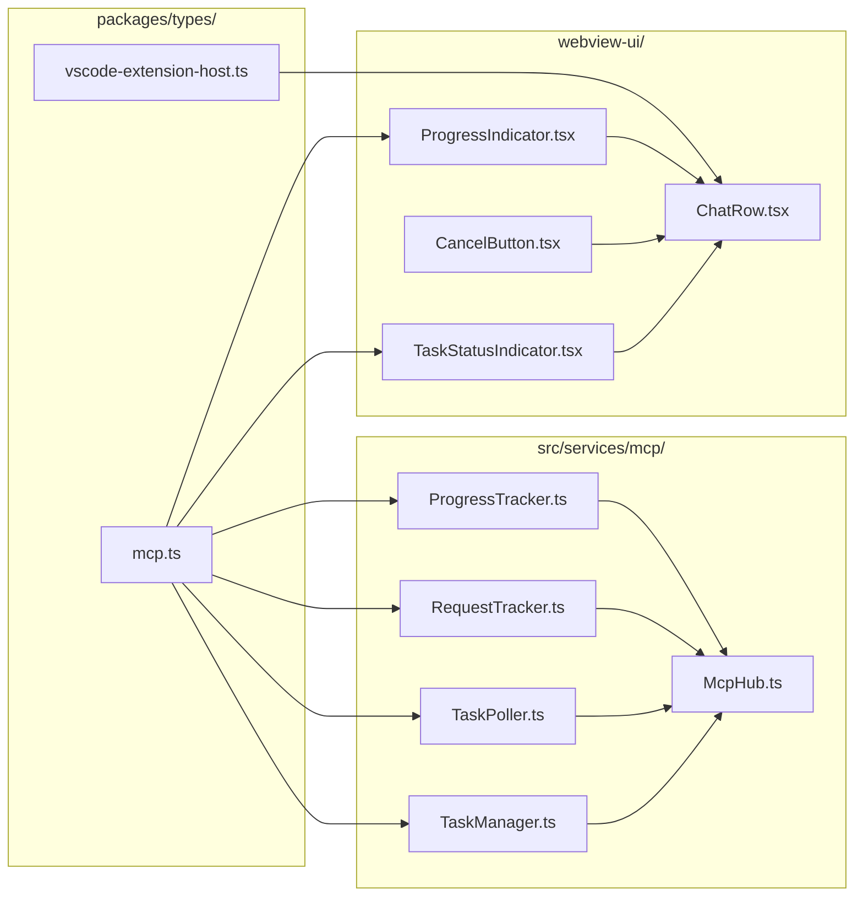

# MCP Utilities Dependency Graph

## Visual Representation



## Dependency Matrix

|                       | 01-progress | 02-cancellation | 03-tasks-core | 04-tasks-receiver |
| --------------------- | ----------- | --------------- | ------------- | ----------------- |
| **01-progress**       | -           | ❌              | ✅            | ✅                |
| **02-cancellation**   | ❌          | -               | ✅            | ✅                |
| **03-tasks-core**     | ❌          | ❌              | -             | ✅                |
| **04-tasks-receiver** | ❌          | ❌              | ❌            | -                 |

**Legend:** ✅ = depends on (row depends on column), ❌ = no dependency

## Implementation Phases

### Phase 1: Foundation (Parallel)

```
┌─────────────────────────────────────────────────────────────────┐
│                        Phase 1                                   │
│                                                                  │
│   ┌─────────────────┐        ┌─────────────────┐                │
│   │  01-progress    │        │ 02-cancellation │                │
│   │                 │   ||   │                 │                │
│   │ ProgressTracker │        │ RequestTracker  │                │
│   │ notifications/  │        │ notifications/  │                │
│   │   progress      │        │   cancelled     │                │
│   └─────────────────┘        └─────────────────┘                │
│                                                                  │
│   Estimated: 4-7 hours (parallel)                               │
└─────────────────────────────────────────────────────────────────┘
```

### Phase 2: Tasks Core

```
┌─────────────────────────────────────────────────────────────────┐
│                        Phase 2                                   │
│                                                                  │
│   ┌─────────────────────────────────────────────────────────┐   │
│   │                   03-tasks-core                          │   │
│   │                                                          │   │
│   │  • TaskPoller (client-side polling)                     │   │
│   │  • callToolAsTask, getTask, getTaskResult               │   │
│   │  • tasks/list, tasks/cancel                             │   │
│   │  • notifications/tasks/status handling                   │   │
│   │                                                          │   │
│   │  Depends on:                                             │   │
│   │    - Progress (progressToken throughout task)           │   │
│   │    - Cancellation (tasks/cancel uses different pattern) │   │
│   └─────────────────────────────────────────────────────────┘   │
│                                                                  │
│   Estimated: 6-8 hours                                          │
└─────────────────────────────────────────────────────────────────┘
```

### Phase 3: Tasks Receiver

```
┌─────────────────────────────────────────────────────────────────┐
│                        Phase 3                                   │
│                                                                  │
│   ┌─────────────────────────────────────────────────────────┐   │
│   │                 04-tasks-receiver                        │   │
│   │                                                          │   │
│   │  • TaskManager (receiver-side state)                    │   │
│   │  • Modified sampling/elicitation handlers               │   │
│   │  • tasks/get, tasks/result, tasks/list, tasks/cancel    │   │
│   │  • notifications/tasks/status emission                   │   │
│   │                                                          │   │
│   │  Depends on:                                             │   │
│   │    - Tasks-Core (shared types, patterns)                │   │
│   │    - Cancellation (abort signal pattern)                │   │
│   └─────────────────────────────────────────────────────────┘   │
│                                                                  │
│   Estimated: 6-8 hours                                          │
└─────────────────────────────────────────────────────────────────┘
```

## File Dependency Graph



## Critical Path

```
SDK Types ─► mcp.ts ─► ProgressTracker ─┐
                                        ├─► McpHub ─► TaskPoller ─► TaskManager
            mcp.ts ─► RequestTracker ───┘

Time estimate (sequential critical path): 16-23 hours
Time estimate (with parallelization):    12-16 hours
```

## Blockers and Dependencies

### External Blockers

| Blocker                | Impact       | Resolution                    |
| ---------------------- | ------------ | ----------------------------- |
| task.ask() AbortSignal | Specs 02, 04 | Check `src/core/task/Task.ts` |
| SDK 1.25.2 exports     | All specs    | Verify schema availability    |

### Internal Dependencies

| Dependency              | Provider          | Consumers         | Type     |
| ----------------------- | ----------------- | ----------------- | -------- |
| ProgressToken types     | 01-progress       | 03-tasks-core     | Type     |
| AbortController pattern | 02-cancellation   | 04-tasks-receiver | Pattern  |
| Task types              | 03-tasks-core     | 04-tasks-receiver | Type     |
| TaskManager             | 04-tasks-receiver | McpHub            | Instance |

---

_Generated by /spec-designer on 2026-01-17_
